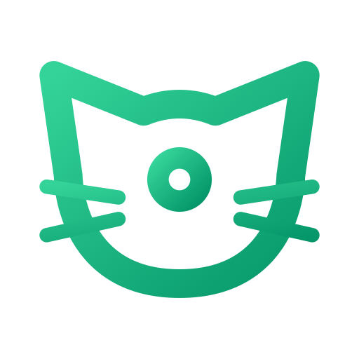

<div align="center">
  
  <h1>NekoVault</h1>
  <p>🔐 A personal TOTP and password manager built for Cloudflare Workers</p>
  <p>
    <strong>English</strong> · <a href="README.md">简体中文</a>
  </p>
</div>

---

NekoVault is a mobile-first personal web app built with **Nuxt 4 + Cloudflare Workers + D1**. It uses a single **Worker-side admin token** for global access control, while keeping an encrypted local snapshot in the browser for offline unlock and recovery.

## Features

### Simple global access control
- Configure `ADMIN_TOKEN` in your Worker environment.
- Enter that token in the client to unlock, read, and sync the vault.
- If `ADMIN_TOKEN` is missing, the server fails closed instead of allowing anonymous access.
- Once unlocked the app stays unlocked until you tap the lock button or close/refresh the page; there is no idle auto-lock timer that can kick you back unexpectedly.

### Personal self-hosted workflow
- Runs on Cloudflare Workers with D1 as the backing store.
- D1 keeps a single Vault JSON document plus a `revision` number for optimistic concurrency.
- The first successful unlock against an empty instance automatically bootstraps an empty vault.

### TOTP codes
- `otpauth://` import, countdown ring, configurable digits / period / algorithm.
- Each TOTP entry can be linked to an account entry for a quick "2FA for this account" lookup.

### Account secrets
- Stores service/category, username, a secret list, notes, and an optional linked TOTP entry.
- One account can hold multiple secrets, such as a default secret, WebDAV app secret, mobile app secret, API token, or recovery key.
- **Optional membership / subscription expiry reminder** per account: enable an expiry date and the card shows a colored remaining-days badge (green / amber / red) so upcoming renewals are obvious at a glance.

### Local encrypted cache
- Uses `Dexie.js + IndexedDB` to keep an encrypted local snapshot.
- Previously synced data can still be unlocked offline.
- Pending writes are retried automatically after the network comes back.

### PWA support
- Ships with `@vite-pwa/nuxt`.
- Can be installed to desktop or mobile home screen.

### Mobile WebView and constrained-browser support
- Designed to work across mobile browsers, Android WebViews, and desktop browsers.
- Icons and critical runtime assets are bundled locally as much as possible to reduce reliance on external resources in strict CSP environments.

---

## Project workflow

1. Install dependencies:

   ```bash
   pnpm install
   ```

2. Create the Cloudflare D1 database:

   ```bash
   pnpm run d1:create
   ```

3. Copy `wrangler.toml.example` to `wrangler.toml`, fill in the D1 `database_id`, and configure `ADMIN_TOKEN`.

4. Initialize the D1 schema:

   ```bash
   pnpm run d1:init-local
   pnpm run d1:init-remote
   ```

5. Start local development:

   ```bash
   pnpm run dev
   ```

6. Run checks and build:

   ```bash
   pnpm run typecheck
   pnpm run lint
   pnpm run build
   ```

7. Deploy to Cloudflare Workers:

   ```bash
   pnpm run deploy
   ```

8. Open the deployed site and enter `ADMIN_TOKEN` to unlock. On first access against an empty instance, NekoVault automatically creates an empty vault; after that you can start saving TOTP codes, account secrets, and settings.

---

## Stack

- **Framework**: Nuxt 4 / Vue 3 / Nitro
- **UI**: Nuxt UI / Tailwind CSS
- **State & utilities**: Pinia / VueUse / Dexie
- **Deployment**: Cloudflare Workers + D1

---

## Deployment

### 1. Install dependencies

```bash
pnpm install
```

### 2. Create the D1 database

```bash
pnpm run d1:create
```

Copy the returned `database_id`.

### 3. Copy and configure Wrangler

Copy the example file first:

```bash
cp wrangler.toml.example wrangler.toml
```

On Windows PowerShell:

```powershell
Copy-Item wrangler.toml.example wrangler.toml
```

Then edit `wrangler.toml` and set at least:

```toml
[[d1_databases]]
binding = "DB"
database_name = "nekovault-db"
database_id = "your-database-id"

[vars]
ADMIN_TOKEN = "your-access-token"
```

The real `wrangler.toml` is intentionally not tracked. The repository only keeps `wrangler.toml.example`.

### 4. Deploy

```bash
pnpm run deploy
```

---

## Local development

### Plain Nuxt dev mode

```bash
pnpm run dev
```

If you want `/api/*` to work locally, provide `ADMIN_TOKEN` first. Example in PowerShell:

```powershell
$env:ADMIN_TOKEN="your-local-dev-token"
pnpm run dev
```

### Worker-like local runtime

For a closer Cloudflare environment:

```bash
npx wrangler dev
```

Make sure `wrangler.toml` already contains the D1 binding and `ADMIN_TOKEN`.

---

## Data model

- Remote: D1 stores one Vault document.
- Local: the browser stores an additional encrypted snapshot for offline unlock.
- Resetting local data only clears the current device cache, not the remote vault.

---

## License

MIT
